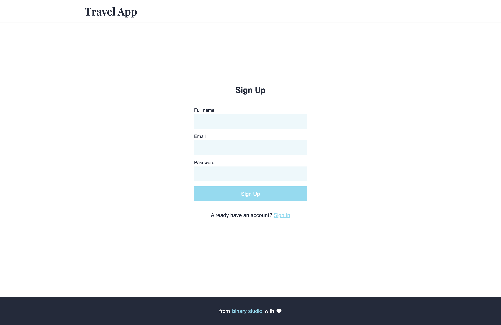
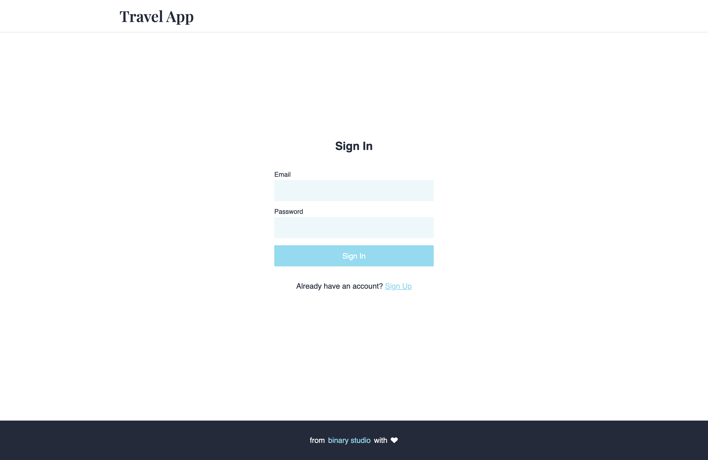
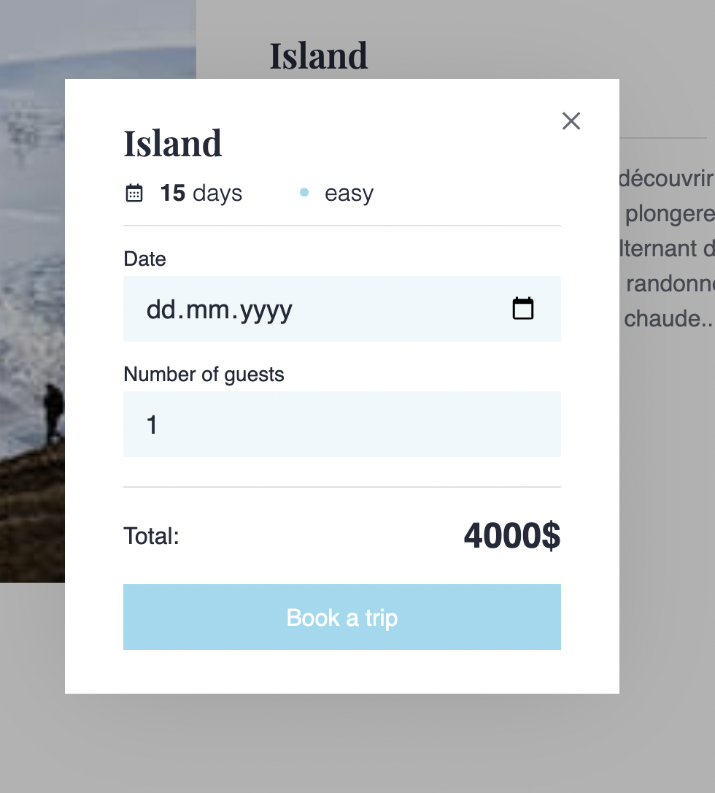
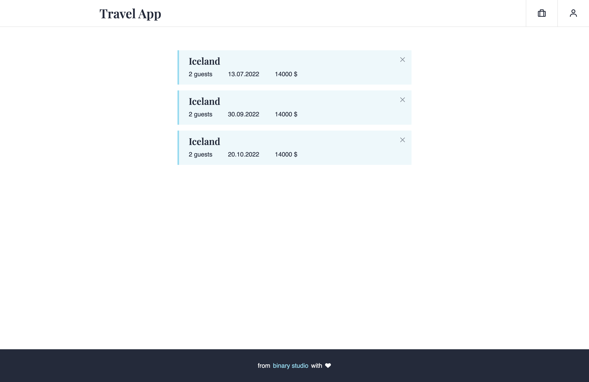

# React Part 1

You need to create a travel app in **React** by rewriting pre-made markup. It can be found in [this repository](https://github.com/BinaryStudioAcademy/react-homework) in the `markup` folder.

The application must contain the following pages:

- `/sing-up` - sign up page
- `/sing-in` - sign in page
- `/` - main page with all trips, search and filters
- `/trip/:tripId` - trip information page
- `/bookings` - list of current user's bookings

### Header

- must be displayed on all pages
- logo is a link to the main page - `/`
- navigation block is displayed on all pages except `/sing-up` and `/sing-in`
- navigation consists of two elements
    - the first element links to the `/bookings` page
    - when you hover over the second element, a list appears with username and Sign Out button
     
    

### Footer

- must be displayed on all pages

### Sign Up

- form contains the following fields:
    - Full name
    - Email
    - Password - must be between 3 and 20 characters long
- all fields are required
- Sign In button leads to the `/sing-in` page

### Sign In

- form contains the following fields
    - Email
    - Password - must be between 3 and 20 characters long
- all fields are required
- Sign Up button leads to the `/sing-up` page

### Main page

- block with filters contains:
    - search bar
    - two selects for duration and level
- when entering a value in the search bar or changing filters, the corresponding cards should be displayed
- trip card contains the following elements:
    - picture
    - name of the trip
    - trip information - duration and level of difficulty
    - price
    - button leading to the trip page

### Trip page

- contains complete information about a trip - picture, name, duration, level, description and price
- when you click Book a trip button, a modal window opens
- modal window

    

    - contains a name, duration and level of the trip
    - form contains the following fields:
        - Date - planned date, should be in the future
        - Number of guest - should be from 1 to 10 inclusive
    - final price is equal to the price multiplied by the number of guests
    - when you press a close button in the upper right corner, the form closes

### Bookings page

    
- list of bookings
    - cards must be sorted by date from nearest to farthest
- booking card contains:
    - name of the trip
    - booking information - number of guests, planned date, final price
    - cancel button in the upper right corner - when pressed, the card should disappear from the list

## Requirements

- all the functionality described above must be present
- you have to use pre-made styles
- keep all data in a component state of the corresponding page
- when switching to any unknown route, the user must be redirected to the main page
- use only **React** and **React Router** libraries (without backend, redux and other libraries)
- you can use any CSS-libraries

## What will be evaluated

- functionality
- splitting and reusing components
- **React Router** routing
- components structure. Function components first
- data encapsulation (component must receive data via props, local state only where needed)
- clean code

Maximum score: 9. You can get one more poing if you:

- deploy app to any service. For example, [Heroku](https://dashboard.heroku.com/)
- use functional approaches and patterns.
- [TypeScript](https://www.typescriptlang.org/)

---

List of trips

 
<pre>
[
  {
    "id": "d96b8374-3efa-4124-8e38-1edd11bd07f5",
    "title": "Iceland",
    "description": "Take part in the adventure and come and discover Iceland, from the Highlands to the Ocean. From the first day, you will dive into the heart of the unique landscapes of this North Atlantic island, alternating travel by vehicle on tracks at the end of the world, long hikes on major natural sites and relaxation in the hot springs. Accompanied by your guide, you will cross the multiple tracks of Iceland revealing the most varied landscapes.",
    "level": "easy",
    "duration": 15,
    "price": 4795,
    "image": "https://i.gyazo.com/0aae9c20e73caebb07c0dbdfe2bbd89c.jpg",
    "createdAt": "2022-05-22T17:14:38.147Z"
  },
  {
    "id": "4c7564ad-fafc-4641-a692-55a683de7fbe",
    "title": "Scotland",
    "description": "In the North of Great Britain, Scotland is a land of character which has much to offer its visitors. Mountains and valleys, islands and cliffs, castles and distilleries, ghosts and legends... Your guide will allow you to better discover the many facets of this region. The accessible and sumptuous hikes will take you to isolated places enjoying splendid or unmissable views because they are so emblematic of the country.",
    "level": "easy",
    "duration": 8,
    "price": 2145,
    "image": "https://i.gyazo.com/9692ef5341a64659e8a211f19808732f.jpg",
    "createdAt": "2022-05-22T17:14:38.147Z"
  },
  {
    "id": "2ba63e60-167d-472a-ab66-55af9115d48e",
    "title": "Norway",
    "description": "This alpine course immerses us in the wild and unique atmosphere of the southern massifs of the Lofoten archipelago. It is in this sector, the most mountainous of the islands, that we have selected the most beautiful hikes, resulting from our long experience, to make you discover breathtaking landscapes.",
    "level": "moderate",
    "duration": 13,
    "price": 2690,
    "image": "https://i.gyazo.com/f51b0738c6850a24dacbfe7ef092abe2.jpg",
    "createdAt": "2022-05-22T17:14:38.147Z"
  },
  {
    "id": "6417f33c-31e0-444a-abac-cd0c1f8e48d0",
    "title": "Spitsbergen",
    "description": "This trip to the last affordable territory before the North Pole allows you to discover one of the most beautiful fjords in Spitsbergen: King’s Bay. Stages between three camps, in the heart of the bay, will allow you to sail in a sea kayak in the middle of the icebergs, to approach seals basking in the sun and to admire the whole bay from the surrounding peaks on a hike. . This polar voyage in King’s Bay will be a memorable experience.",
    "level": "moderate",
    "duration": 11,
    "price": 3495,
    "image": "https://i.gyazo.com/682bf539e0ed5041621703b1a45e532f.jpg",
    "createdAt": "2022-05-22T17:14:38.147Z"
  },
  {
    "id": "b192252e-2bb6-4cf3-b9cb-34a8a2f94891",
    "title": "Greenland",
    "description": "Exceptional trip of nearly three weeks to the very north of Disko Bay, sanctuary of the largest icebergs in the northern hemisphere. A unique and exploratory stay in this isolated area of northern Greenland where tourist attendance remains sporadic.",
    "level": "difficult",
    "duration": 19,
    "price": 5395,
    "image": "https://i.gyazo.com/eef2d8dea9e6c55f1bb906ca1f5850b0.jpg",
    "createdAt": "2022-05-22T17:14:38.147Z"
  },
  {
    "id": "e5c23843-455a-46c2-bedb-af269089fba7",
    "title": "Ireland",
    "description": "Immersed in the Emerald Isle, with your guide and a small group of 8 people maximum, you will discover all the wonders of Ireland. This sumptuous, green and hilly island is rich in exceptional natural sites. Fishing villages or colorful towns, vertiginous cliffs and jagged points, geological or archaeological sites, this varied stay will allow you to visit, by carrying out hikes affordable for all, and to immerse yourself in the country. Evenings in festive towns or villages will allow you to discover the heart of Ireland, its people.",
    "level": "easy",
    "duration": 8,
    "price": 1995,
    "image": "https://i.gyazo.com/f13e6780cd7c0d7440ed04d58d948db3.jpg",
    "createdAt": "2022-05-22T17:14:38.147Z"
  }
]
</pre>

List of bookings

 
<pre>
[
  {
	  "id": "73b7df68-62f6-4a5f-9c87-f971637ac7a0",
	  "userId": "1dd97a12-848f-4a1d-8a7d-34a2132fca94",
	  "tripId": "b192252e-2bb6-4cf3-b9cb-34a8a2f94891",
	  "guests": 2,
	  "date": "2022-06-23T14:37:00.049Z",
	  "trip": {
	    "title": "Greenland",
	    "duration": 19,
	    "price": 5395
	  },
	  "totalPrice": 10790,
	  "createdAt": "2022-05-22T17:42:49.537Z"
  },
	{
	  "id": "37474dad-8407-473d-a0a1-cdb695120fad",
	  "userId": "1dd97a12-848f-4a1d-8a7d-34a2132fca94",
	  "tripId": "e5c23843-455a-46c2-bedb-af269089fba7",
	  "guests": 1,
	  "date": "2022-07-30T14:37:00.049Z",
	  "trip": {
	    "title": "Ireland",
	    "duration": 8,
	    "price": 1995
	  },
	  "totalPrice": 1995,
	  "createdAt": "2022-05-22T17:44:02.700Z"
	},
	{
	  "id": "ee3be8e7-648f-4fce-bdb5-ba0c7cb38c55",
	  "userId": "1dd97a12-848f-4a1d-8a7d-34a2132fca94",
	  "tripId": "4c7564ad-fafc-4641-a692-55a683de7fbe",
	  "guests": 1,
	  "date": "2022-09-03T14:37:00.049Z",
	  "trip": {
	    "title": "Scotland",
	    "duration": 8,
	    "price": 2145
	  },
	  "totalPrice": 2145,
	  "createdAt": "2022-05-22T17:44:56.660Z"
	},
	{
	  "id": "50f6bc2e-808d-48ed-970e-4acde5d7e723",
	  "userId": "1dd97a12-848f-4a1d-8a7d-34a2132fca94",
	  "tripId": "6417f33c-31e0-444a-abac-cd0c1f8e48d0",
	  "guests": 2,
	  "date": "2022-11-22T14:37:00.049Z",
	  "trip": {
	    "title": "Spitsbergen",
	    "duration": 11,
	    "price": 3495
	  },
	  "totalPrice": 6990,
	  "createdAt": "2022-05-22T17:45:41.982Z"
	}
]
</pre>

