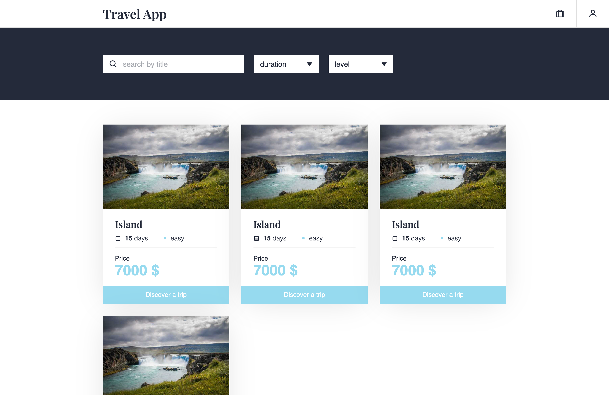
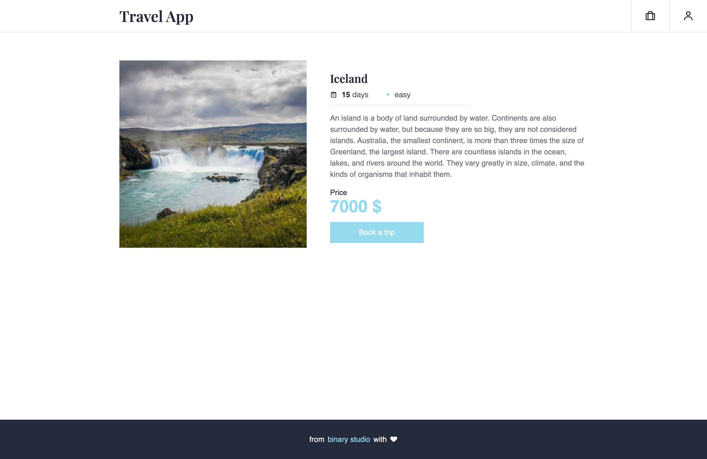

# React Part 1

Необхідно створити додаток для подорожей у **React** переписавши готову розмітку. Її можна знайти у [цьому репозиторії]('https://github.com/BinaryStudioAcademy/react-homework') у папці `markup`.

Додаток повинен містити такі сторінки:

- `/sing-up` - сторінка регістрації
- `/sing-in` - сторінка логіну
- `/` - головна сторінка з карточками усіх поїздок, пошуком та фільтрами
- `/trip/:tripId` - сторінка з інформацією про поїздку
- `/bookings` - список бронювань поточного користувача

### Header

- має бути присутнім на усіх сторінках
- логотип є посиланням на головну сторінку - `/`
- блок з навігацією відображається на усіх сторінках, окрім `/sing-up` та `/sing-in`
- навігація складається з двух елементів
    - перший елемент веде на сторінку `/bookings`
    - при наведенні на другий елемент з’являється список з іменем користувача та кнопкою Sign Out
     
    

### Footer

- має бути присутнім на усіх сторінках

### Sign Up

- форма містить такі поля:
    - Full name
    - Email
    - Password - має бути від 3 до 20 символів
- усі поля є обов’язковими
- кнопка Sign In веде на сторінку `/sing-in`

### Sign In

- форма містить такі поля:
    - Email
    - Password - має бути від 3 до 20 символів
- усі поля є обов’язковими
- кнопка Sign Up веде на сторінку `/sing-up`

### Головна сторінка

- блок з фільтрами містить:
    - поле пошуку
    - два селекти для вибору тривалості та рівня
- при веденні значення в поле пошуку чи зміні фільтрів мають відображатися відповідні картки
- картка подорожі містить такі елементи:
    - картинка
    - назва подорожі
    - інформація про подорож - тривалість та складність
    - ціна подорожі
    - кнопка, що веде на сторінку подорожі

### Сторінка подорожі

- містить повну інформацію про подорож: картинку, назву, тривалість, складність, опис та ціну
- при натисканні кнопки Book a trip відкривається модальне вікно
- модальне вікно

     

    - містить назву, тривалість та складність подорожі
    - форма містить такі поля:
        - Date - запланована дата, має бути в майбутньому
        - Number of guest - кількість гостей, має бути від 1 до 10 включно
    - кінцева ціна дорівнює ціні помноженій на кількість гостей
    - при натисканні кнопки у верхньому правому кутку форма закривається

### Сторінка бронювань

    
- список з бронюваннями
    - карточки повинні сортуватися за датою від найближчої до найдальшої
- карточка бронювання містить:
    - назву подорожі
    - інформацію про бронювання - кількість гостей, заплановану дату, кінцеву ціну
    - кнопку для відміни бронювання у верхньому правому кутку - при натисканні карточка повинна зникати зі списку

## Вимоги до завдання

- має бути присутнім увесь функціонал описанний вище
- потрібно використовувати готові стилі
- усі данні зберігати у стейті компонента відповідної сторінки
- при переході на будь-який невідомий роут, користувач має повертатися на головну сторінку
- використовувати лише бібліотеки **React** та **React Router** (без backend, redux та інших бібліотек)
- можна використовувати будь-які CSS-бібліотеки

## Що буде оцінюватися

- функціонал
- розбиття та перевикористання компонентів
- роутінг на основі **React Router**
- структура компонентів. Function components first
- інкапсуляція данних (компонент має отримувати данні через props, локальный state лише там, де потрібно)
- чистота коду

Максимальний балл: 9. Ще один балл можно отримати, якщо:

- задеплоїти работу на будь-який сервіс. Наприклад, [Heroku](https://dashboard.heroku.com/).
- використовувати функциональні підходи та паттерни.
- [TypeScript](https://www.typescriptlang.org/)

---

Данні для використання:

Cписок подорожей

 
<pre>
[
  {
    "id": "d96b8374-3efa-4124-8e38-1edd11bd07f5",
    "title": "Iceland",
    "description": "Take part in the adventure and come and discover Iceland, from the Highlands to the Ocean. From the first day, you will dive into the heart of the unique landscapes of this North Atlantic island, alternating travel by vehicle on tracks at the end of the world, long hikes on major natural sites and relaxation in the hot springs. Accompanied by your guide, you will cross the multiple tracks of Iceland revealing the most varied landscapes.",
    "level": "easy",
    "duration": 15,
    "price": 4795,
    "image": "https://i.gyazo.com/0aae9c20e73caebb07c0dbdfe2bbd89c.jpg",
    "createdAt": "2022-05-22T17:14:38.147Z"
  },
  {
    "id": "4c7564ad-fafc-4641-a692-55a683de7fbe",
    "title": "Scotland",
    "description": "In the North of Great Britain, Scotland is a land of character which has much to offer its visitors. Mountains and valleys, islands and cliffs, castles and distilleries, ghosts and legends... Your guide will allow you to better discover the many facets of this region. The accessible and sumptuous hikes will take you to isolated places enjoying splendid or unmissable views because they are so emblematic of the country.",
    "level": "easy",
    "duration": 8,
    "price": 2145,
    "image": "https://i.gyazo.com/9692ef5341a64659e8a211f19808732f.jpg",
    "createdAt": "2022-05-22T17:14:38.147Z"
  },
  {
    "id": "2ba63e60-167d-472a-ab66-55af9115d48e",
    "title": "Norway",
    "description": "This alpine course immerses us in the wild and unique atmosphere of the southern massifs of the Lofoten archipelago. It is in this sector, the most mountainous of the islands, that we have selected the most beautiful hikes, resulting from our long experience, to make you discover breathtaking landscapes.",
    "level": "moderate",
    "duration": 13,
    "price": 2690,
    "image": "https://i.gyazo.com/f51b0738c6850a24dacbfe7ef092abe2.jpg",
    "createdAt": "2022-05-22T17:14:38.147Z"
  },
  {
    "id": "6417f33c-31e0-444a-abac-cd0c1f8e48d0",
    "title": "Spitsbergen",
    "description": "This trip to the last affordable territory before the North Pole allows you to discover one of the most beautiful fjords in Spitsbergen: King’s Bay. Stages between three camps, in the heart of the bay, will allow you to sail in a sea kayak in the middle of the icebergs, to approach seals basking in the sun and to admire the whole bay from the surrounding peaks on a hike. . This polar voyage in King’s Bay will be a memorable experience.",
    "level": "moderate",
    "duration": 11,
    "price": 3495,
    "image": "https://i.gyazo.com/682bf539e0ed5041621703b1a45e532f.jpg",
    "createdAt": "2022-05-22T17:14:38.147Z"
  },
  {
    "id": "b192252e-2bb6-4cf3-b9cb-34a8a2f94891",
    "title": "Greenland",
    "description": "Exceptional trip of nearly three weeks to the very north of Disko Bay, sanctuary of the largest icebergs in the northern hemisphere. A unique and exploratory stay in this isolated area of northern Greenland where tourist attendance remains sporadic.",
    "level": "difficult",
    "duration": 19,
    "price": 5395,
    "image": "https://i.gyazo.com/eef2d8dea9e6c55f1bb906ca1f5850b0.jpg",
    "createdAt": "2022-05-22T17:14:38.147Z"
  },
  {
    "id": "e5c23843-455a-46c2-bedb-af269089fba7",
    "title": "Ireland",
    "description": "Immersed in the Emerald Isle, with your guide and a small group of 8 people maximum, you will discover all the wonders of Ireland. This sumptuous, green and hilly island is rich in exceptional natural sites. Fishing villages or colorful towns, vertiginous cliffs and jagged points, geological or archaeological sites, this varied stay will allow you to visit, by carrying out hikes affordable for all, and to immerse yourself in the country. Evenings in festive towns or villages will allow you to discover the heart of Ireland, its people.",
    "level": "easy",
    "duration": 8,
    "price": 1995,
    "image": "https://i.gyazo.com/f13e6780cd7c0d7440ed04d58d948db3.jpg",
    "createdAt": "2022-05-22T17:14:38.147Z"
  }
]
</pre>

Cписок бронювань

 
<pre>
[
  {
	  "id": "73b7df68-62f6-4a5f-9c87-f971637ac7a0",
	  "userId": "1dd97a12-848f-4a1d-8a7d-34a2132fca94",
	  "tripId": "b192252e-2bb6-4cf3-b9cb-34a8a2f94891",
	  "guests": 2,
	  "date": "2022-06-23T14:37:00.049Z",
	  "trip": {
	    "title": "Greenland",
	    "duration": 19,
	    "price": 5395
	  },
	  "totalPrice": 10790,
	  "createdAt": "2022-05-22T17:42:49.537Z"
  },
	{
	  "id": "37474dad-8407-473d-a0a1-cdb695120fad",
	  "userId": "1dd97a12-848f-4a1d-8a7d-34a2132fca94",
	  "tripId": "e5c23843-455a-46c2-bedb-af269089fba7",
	  "guests": 1,
	  "date": "2022-07-30T14:37:00.049Z",
	  "trip": {
	    "title": "Ireland",
	    "duration": 8,
	    "price": 1995
	  },
	  "totalPrice": 1995,
	  "createdAt": "2022-05-22T17:44:02.700Z"
	},
	{
	  "id": "ee3be8e7-648f-4fce-bdb5-ba0c7cb38c55",
	  "userId": "1dd97a12-848f-4a1d-8a7d-34a2132fca94",
	  "tripId": "4c7564ad-fafc-4641-a692-55a683de7fbe",
	  "guests": 1,
	  "date": "2022-09-03T14:37:00.049Z",
	  "trip": {
	    "title": "Scotland",
	    "duration": 8,
	    "price": 2145
	  },
	  "totalPrice": 2145,
	  "createdAt": "2022-05-22T17:44:56.660Z"
	},
	{
	  "id": "50f6bc2e-808d-48ed-970e-4acde5d7e723",
	  "userId": "1dd97a12-848f-4a1d-8a7d-34a2132fca94",
	  "tripId": "6417f33c-31e0-444a-abac-cd0c1f8e48d0",
	  "guests": 2,
	  "date": "2022-11-22T14:37:00.049Z",
	  "trip": {
	    "title": "Spitsbergen",
	    "duration": 11,
	    "price": 3495
	  },
	  "totalPrice": 6990,
	  "createdAt": "2022-05-22T17:45:41.982Z"
	}
]
</pre>

